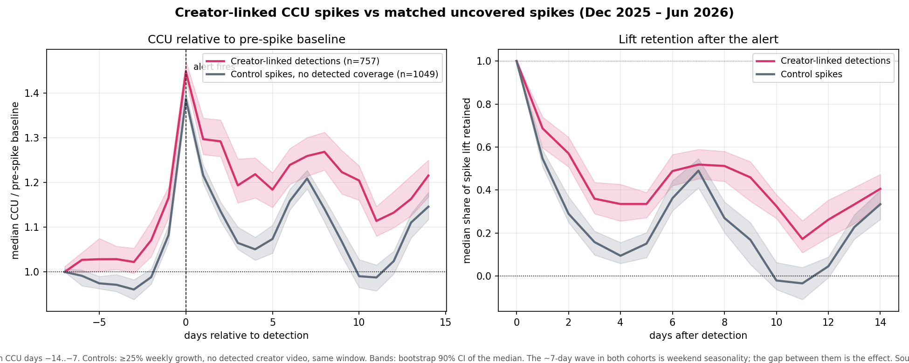

# Early Shift

**Creator-linked CCU spike detection for Roblox, validated against matched controls.**

Early Shift collects a continuous panel of Roblox concurrent-user (CCU) data, matches sharp CCU rises to recent YouTube creator coverage, and measures whether creator-linked spikes behave differently from ordinary ones. The question it answers: when a game surges, did a creator drive it, is there still upside, and will it hold?

This is a research and analytics project built on a self-collected dataset, the headline claims are backtested, with methodology and limitations documented openly.

## Key result

Backtested across **689 creator-linked spike episodes** against size- and time-matched control spikes (Dec 2025 – Jun 2026):

- **Early warning.** Alerts fire a median of **2 days before** the local CCU peak, with roughly **18% median CCU upside** still ahead.
- **Retention.** Creator-linked spikes retain significantly more of their lift at 7 days than matched uncovered spikes; median retention **0.50 vs 0.37**, paired sign test **p ≈ 0.002**.
- **Genre heterogeneity.** RPG and Strategy spikes tend to hold (75% sustained); Sports & Racing spikes are mostly flash traffic (45%).

An earlier, smaller sample showed *no* retention effect; that null and the reason it was superseded (sample size and a scheduling artifact) are documented rather than hidden. Full methodology, controls, and caveats are in **[analysis/BACKTEST_REPORT.md](analysis/BACKTEST_REPORT.md)**, with the event study below.



## The dataset

The core asset is the panel itself. Roblox's public API serves only *current* CCU, so historical CCU cannot be reconstructed after the fact. Early Shift has polled continuously since September 2025:

- 160K CCU observations across 1,700 games, at multi-hour resolution
- 63K videos from tracked Roblox creators
- Modern genre taxonomy backfilled per game

All stored locally in DuckDB (`early_shift.db`).

## How it works

1. **Collection** -> `roproxy_client.py` polls current CCU for top games via official Roblox public endpoints; `youtube_collector.py` pulls recent videos from tracked creators. Both append to DuckDB.
2. **Detection** -> `mechanic_detector.py` flags games whose CCU rose above 25% versus 7 days prior with a matching creator video within 48h (fuzzy title match; codes/exploit-spam videos filtered out).
3. **Evaluation** -> `analysis/` replays the detector over the historical panel, builds size- and time-matched control groups, and measures lift retention and lead time (`backtest.py`, `backtest_stats.py`, `event_study.py`).

Detections can be delivered to studios as alerts (Notion, via `add_studio.py`), but that delivery layer is secondary to the analysis.

**Stack:** Python 3.11, DuckDB, aiohttp, RapidFuzz, pandas, matplotlib.

## Repository

- `analysis/` -> the backtest, event study, and report (the core of the project)
- `mechanic_detector.py` -> detection rules
- `roproxy_client.py`, `youtube_collector.py` -> collectors
- `schema.py`, `db_manager.py`, `queries.py` -> DuckDB layer
- `public_lite_dashboard.py` -> Streamlit view of detections
- `check_my_game.py` -> single-game lookup for a studio

## Running it

```bash
pip install -r requirements.txt
python main.py                 # one collection cycle
python analysis/backtest.py    # reproduce the backtest from early_shift.db
pytest test_mechanic_detector.py
```

Configuration is via `.env` (see `.env.example`): polling interval, growth threshold, tracked-game count, and the creator list in `data/youtube_channels.json`.

## Limitations

- **Correlational, not causal.** Matching controls for size, timing, and spike magnitude reduces the possibility that creators simply cover games already poised to hold. Results are framed as evidence-backed correlation, not attribution.
- **Control contamination.** Only around 150 creator channels are tracked, so some "uncovered" control spikes likely had coverage that wasn't observed. This biases the measured effect *downward*.
- **Mechanic classification is not validated.** An early attempt to label the *type* of mechanic behind each spike proved unreliable and is used in no reported result.

## Data and compliance

- Uses only public endpoints (Roblox public game data, YouTube Data API v3) within published rate limits.
- No authentication, no personal data.
- Historical CCU is built from repeated polling of public game data.

---

Built by [@SanchitSharma10](https://github.com/SanchitSharma10).
